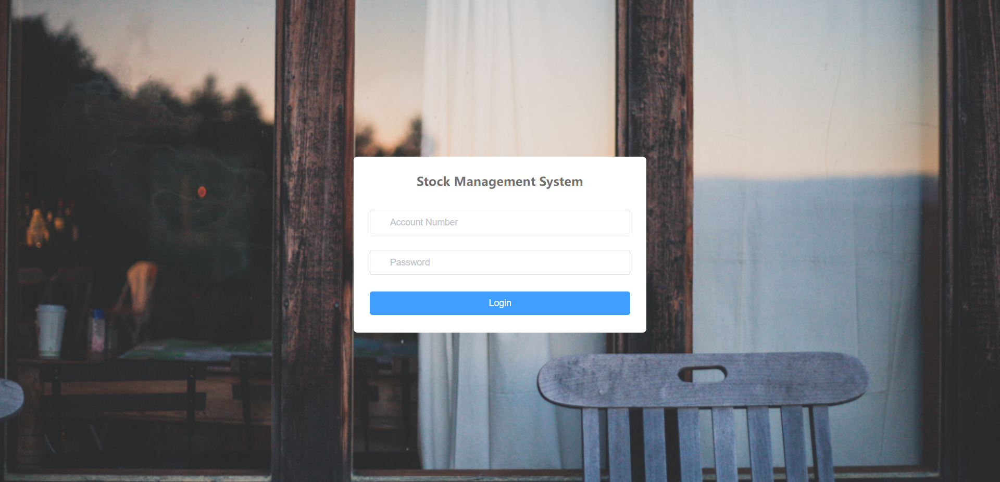
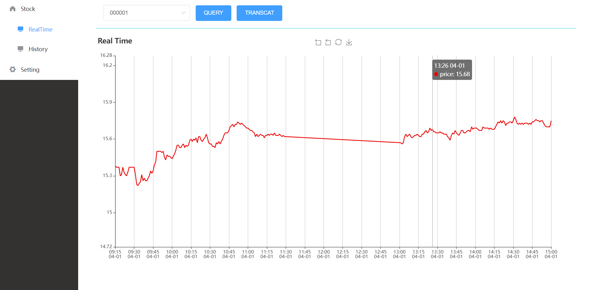
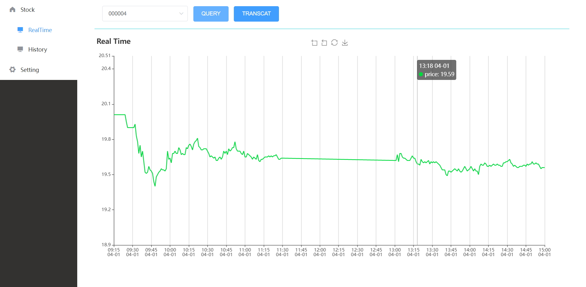
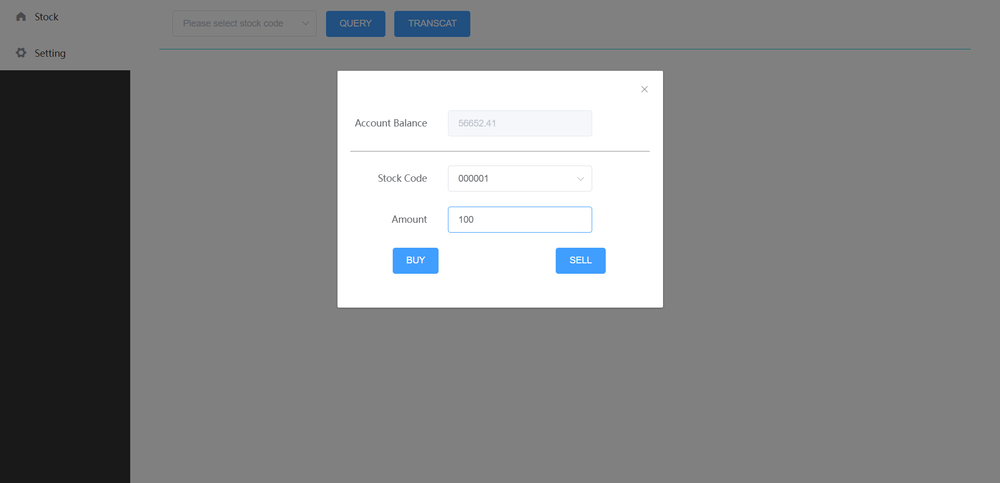
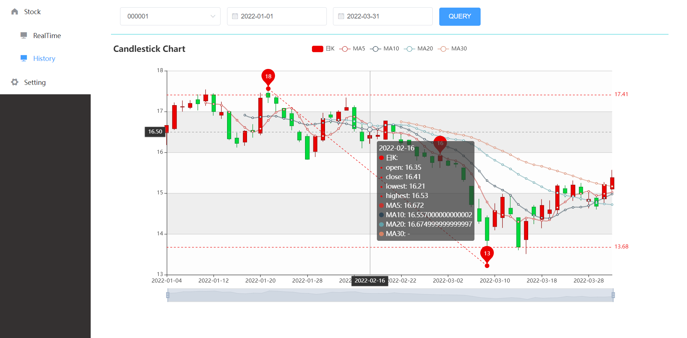
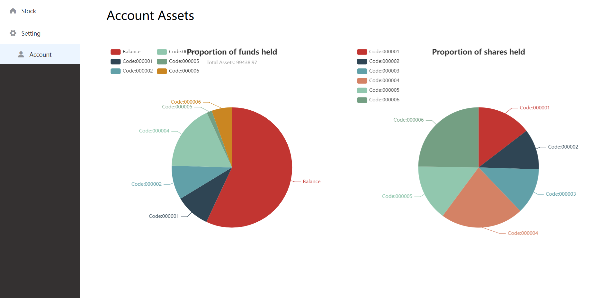

# Stock Management System
## Introduction
### Summary
This project is a stock management system based on the real data of Shanghai and Shenzhen stocks.
### Features
This item can display the stock price of the current day in real time and the trend (up or down) of the stock price of the current day. And the stock can be traded according to the current real-time price. You can view the K-line chart of historical data of stocks over a period of time. You can also view the asset proportion of users. In this project, flash library is used as the source of stock data, Vue is used to make the front end, and ecarts is used to make chart display.
## Requirements
* Windows 10
* Python 3.7
* Flask 2.0.3
* SQLAlchemy 1.4.32
* nodejs 12.16.1
* vue 2.9.6
## Installation
### Install Python's dependent Libraries
Install the flask Library:
```
pip install flask
```
Install database:
```
pip install mysql
pip install SQLAlchemy
```
### Install Vue dependency package
```
npm install
```
## Usage
First run the python file app.py.
```
python app.py
```
If there is no mytest.db, this file is automatically created as a database file. Finally, run the Vue program.
```
npm run serve
```
You can also compile the project with the following command.
```
npm run build
```
After the project runs, open the website http://localhost To access this system.
## Development
Front and back end program utilization http://localhost:5000 Interface and use the methods of get and post to interact. The following is the meaning of each document.
* `app.py` is a back-end program.
* `mytest.db` is a database file.
* `vue/App.vue` is the front-end entry program.
* `vue/views` contains the program files of the front end.
## Demonstration diagram






## Authors
This project is completed by Peng Wang, Zhongyu Liu and Yu Shang.